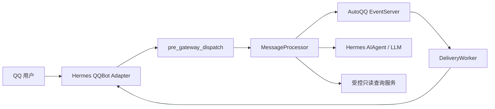

# 当前架构

本文描述 AutoQQ Hermes Plugin 当前实现的运行边界、主要组件和关键数据流。权限、命令及
EventServer HTTP 交互的规范细节以 [Plugin Contract](../CONTRACT.md) 为准；部署步骤以
[README](../README.md) 为准。

## 观察基线

| 项目 | 值 |
| --- | --- |
| 观察日期 | 2026-09-26 |
| Git 分支 | `main` |
| 源码基线 | `main`，并包含当前工作区的订阅绑定上下文更新 |
| 包版本 | `0.4.0` |
| Python | `>=3.12` |

架构事实来自 `plugin.yaml`、`pyproject.toml`、`autoqq_business_plugin/`、`config/` 和测试。
Hermes、QQBot Adapter、EventServer 与查询服务的线上部署状态不在本仓库内，本文只描述代码中
声明和验证的关系。

## 系统上下文



Plugin 由 Hermes Gateway 作为 `hermes_agent.plugins` entry point 加载，注册
`pre_gateway_dispatch` hook，并在 QQBot adapter 绑定后启动 delivery worker。它没有独立的
HTTP 服务或数据库。

## 组件与职责

| 组件 | 主要文件 | 当前职责 |
| --- | --- | --- |
| Hermes 适配层 | `plugin.py`、`__init__.py`、`plugin.yaml` | 创建运行时、注册 hook、绑定 QQBot adapter、管理关闭流程 |
| 消息决策 | `processor.py`、`identity.py`、`models.py` | 提取可信身份，区分命令和聊天，生成 `allow` 或 `skip` 决策 |
| 命令层 | `commands.py`、`command_policy.py`、`config/commands.yaml` | 执行确定性命令、参数校验、帮助和权限策略 |
| EventServer 客户端 | `eventserver_client.py` | 权限、事件目录、订阅、配对、管理和 delivery HTTP 调用 |
| 查询层 | `query_catalog.py`、`query_params.py`、`query_client.py`、`config/queries.yaml` | 把受控命令别名映射到服务端查询目录并验证参数 |
| 投递层 | `delivery_worker.py`、`delivery_renderer.py`、`hermes_sender.py` | 领取与校验 delivery，渲染通用命中元数据，经 QQBot 私聊，回写 `ack` 或 `fail` |
| 进程内保护 | `permission_cache.py`、`rate_limit.py`、`observability.py` | 短期权限缓存、命令限流和脱敏日志 |
| 配置 | `config.py`、`.env.example` | 校验 URL、Token、超时、缓存、查询和轮询配置 |

## 消息处理流

```text
Hermes event
  -> 从可信 QQBot payload 提取 platform/openid/chat_type/chat_id
  -> 查询 EventServer 权限快照
  -> 斜杠命令：策略检查 -> 确定性执行 -> skip LLM
  -> 普通消息：active + chat=true -> allow LLM
  -> 其他情况：block
```

所有斜杠命令都由 Plugin 终止处理，包括未知命令和格式错误命令。`public`、`authorized`、
`admin` 只决定命令需要的权限层级；`blocked` 状态、身份可信度、限流和 EventServer 可用性始终
先于命令执行。EventServer 请求失败时不会退化为允许进入 LLM。

`/bind` 把当前 `chat_type/chat_id` 作为通用 `binding_context` 提交给 EventServer。命令回复始终
发送到当前 `chat_id`，因此私聊原路回复、群聊回到原群；群聊 `/bind` 再由 `hermes_sender.py`
在发送边界添加可信发送者的 QQ @ 标记。EventServer 生成 delivery 时把这一上下文固化为目标；
Plugin 对群聊通知同样添加订阅用户的 QQ @，旧目标缺失上下文时回退为 OpenID 私聊。

Plugin 展示和管理 `bind` scope，但不自行判断事件前缀。创建或更新订阅时，EventServer 先把别名
解析成规范事件键，再按 `*`、`domain.*`、`domain.resource.*` 的点分隔边界鉴权，并在发布时
再次过滤。权限变更成功后 Plugin 立即清除该用户的权限缓存。

## 按需查询流

```text
/wf 输入
  -> config/queries.yaml 解析领域别名
  -> 查询服务目录解析 query_key、action 和参数
  -> Plugin 本地完成类型、必填项、枚举和长度校验
  -> QueryServiceClient 发起受限 GET
  -> 文本回复，或由 QQBot Adapter 发送受控 HTTP(S) 图片
  -> skip LLM
```

`QUERY_SERVICE_TOKEN` 只授权查询，不等同于 EventServer 的 `INTERNAL_API_TOKEN` 或 Publisher
Token。用户不能通过命令提供 URL、路径或模板表达式。

## 主动通知流

```text
DeliveryWorker claim
  -> 校验 platform、openid、原始消息长度和租约字段
  -> 校验 target.chat_type/chat_id；旧 delivery 回退到 openid 私聊
  -> 解析 message.data.subscription_match.items
  -> 精确匹配「• <label>」整行并渲染为「• **<label>** 🔴」
  -> 重新校验最终消息长度
  -> HermesSender 调用 QQBot adapter 发送到 chat_id；群聊正文前 @ openid
  -> 成功：ack(delivery_id, lease_token)
  -> 失败：fail(delivery_id, lease_token, retryable, error_code)
```

Plugin 不决定重试次数和 `dead` 状态。EventServer 负责租约、退避和最终状态。发送成功但
`ack` 前进程退出时可能重复发送，因此当前语义是至少一次投递。

Renderer 不读取 `event_key` 或 Warframe 领域数据。元数据缺失、结构非法或渲染后超长时，
它返回原文。同一标签出现在多个来源分组时，每个完整项目符号行都会命中。
QQBot 的 Markdown 能力由 Hermes `platforms.qqbot.extra.markdown_support` 控制，不属于 Plugin 环境变量。

## 状态与故障边界

- 权限缓存和查询目录缓存只存在于 Plugin 进程；权限、订阅和 delivery 的事实来源仍是
  EventServer。
- Plugin 重启会清空本地缓存；已领取但未确认的 delivery 等租约过期后由 EventServer 重新开放。
- 查询服务不可用只影响对应查询命令，不会创建订阅或进入 LLM。
- QQBot adapter 不可用会阻止主动发送；EventServer 根据 `fail` 或租约过期决定后续动作。
- Plugin 不持有 MySQL、QQ App Secret 或腾讯 QQ API 凭据。

## 仓库地图

```text
plugin/
├── autoqq_business_plugin/   运行时代码
├── config/                   命令和查询目录
├── docs/                     集成与架构说明
├── tests/                    单元和适配契约测试
├── plugin.yaml               Hermes manifest
├── pyproject.toml            Python 包、entry point 和工具配置
├── CONTRACT.md               权限、命令和 HTTP 契约
└── README.md                 部署、使用和运维入口
```

## 验证入口

在已经准备好开发依赖的本仓库环境运行：

```bash
python3 -m pytest
ruff check .
ruff format --check .
```

测试默认使用 fixture 和 mock，不连接真实 EventServer、Hermes 或 QQ。
